# No.456 - (Final_Project)

#### 서비스 대표 이미지

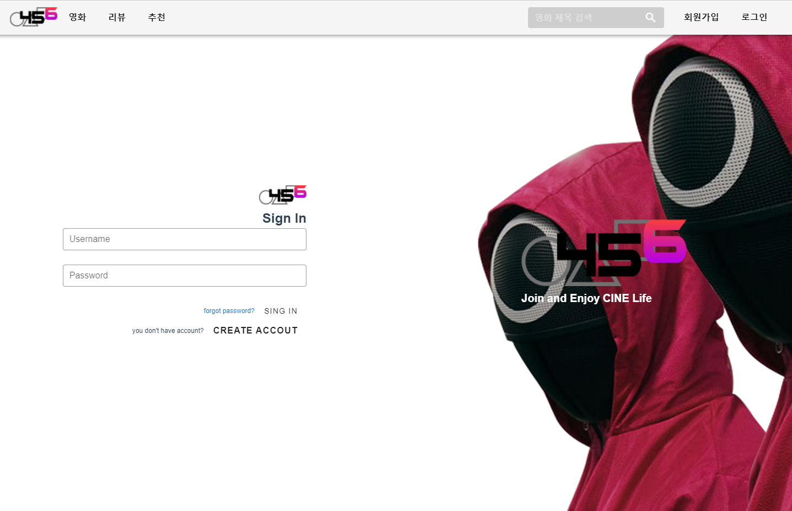


## 0. 사전 필요 코드, Command

```
# Vue
npm install
npm run serve
```

```
# Django
pip install -r requirments.txt
python manage.py makemigrations
python manage.py migrate
python manage.py runserver
```


--------------------------------------

#### 아키텍처

- Django REST API 서버 & Vue.js


#### 개발환경

- python - 3.9.6

- Django - 3.2.6
- djangorestframework - 3.12.4
- python-decouple - 3.5
- djangorestframework-simplejwt - 5.0.0
- django-cors-headers - 3.10.0

- Node.js LTS


- Vue.js - 2.6.11
- vuex - 3.4.0
- vuetify - 2.4.0
- vue-router - 3.2.0
- lodash - 4.17.21
- axios - 0.24.0
- vue-infinite-loading - 2.4.5
- vue-scratchable - 0.3.3
- aos - 2.3.4
- vue-chartjs - 3.5.1


### 📃개발 환경 및 일정 관리

- Git


- Notion

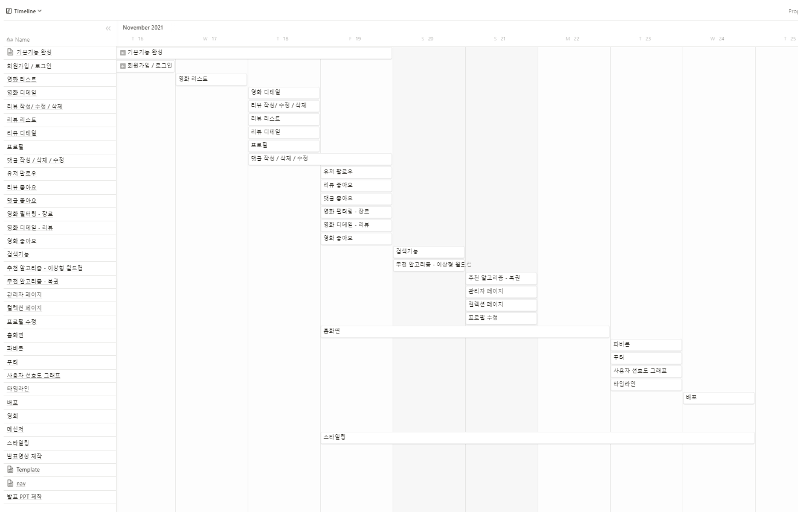

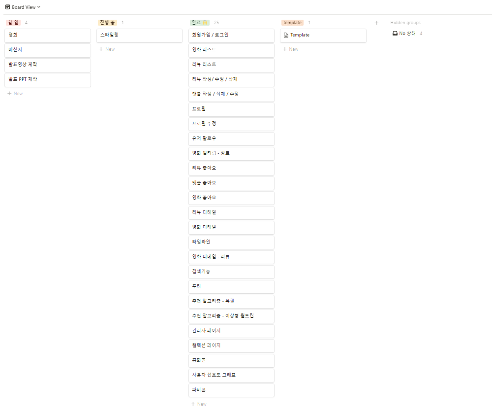

## 1. 정보

- <b>박준용</b>
  - <b>Django(Backend), Vue.js(Frontend),  Sub Design, Main Project Planning</b>


## 2. 목표 서비스 구현 및 실제 구현 정도

😀**목표 : 영화 데이터 기반의 정보 제공 사이트**

##### 로그인, 로그아웃, 프로필 수정

##### 기본적인 영화 정보 조회 (장르별, 일간-주간 차트별 등), 좋아요, 영화 댓글 평점, 리뷰 작성 기능

##### 커뮤니티, 마이페이지(나의 리뷰 조회, 좋아한 영화 조회, 타임라인, 좋아하는 장르 분석 그래프 등) 기능을 함께 구현

##### 영화 추천 시스템은 투표수를 기준으로 영화 데이터를 추출하고 영화 게임 진행, 복권 형태의 추천을 달고나 게임과 접목시켜 재미요소 증가

##### 실제 웹서비스에 비견될 수 있는 완성도를 갖추기 위한 JS, CSS 기능 구현

##### vuetify 활용을 통해 다양한 형태의 서비스로 정보 제공

##### DB에 있는 영화를 기준으로 검색 기능 제공


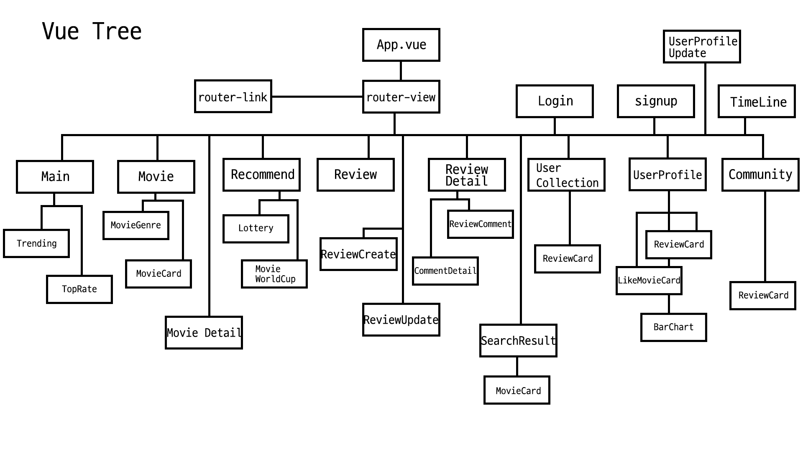

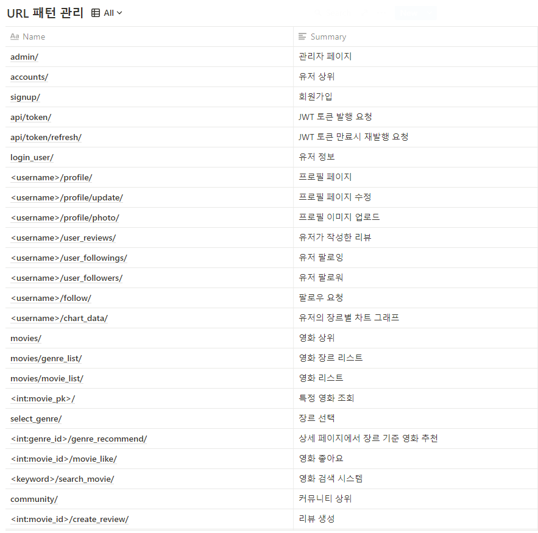

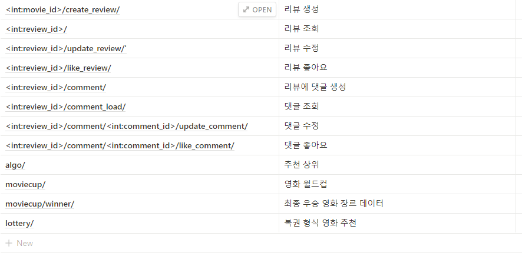


## 3. 데이터 추출 및 데이터베이스 모델링(ERD)

- 데이터 추출 과정
  - TMDB API를 활용하여 사용할 수 있는 데이터를 추출 및 DB에 결합
  - 약 9,900개 영화 데이터 & 장르 데이터 & credit 데이터


- 에러 처리

  - 예외처리 사례 (try, except 구문으로 예외처리하고 분석)

    - TMDB API에서 빈 데이터인 경우, null값인 경우
      - pass하고 다음 부분에 대한 영화 데이터를 계속적으로 추출

    

    - 내용이 없는 경우
      - try: ~ except: 예외처리를 통해 로그에 기록하고 어떤 부분이 문제인지 분석
      - 규칙을 찾을 수 없으면 제외

- `movies2.json`

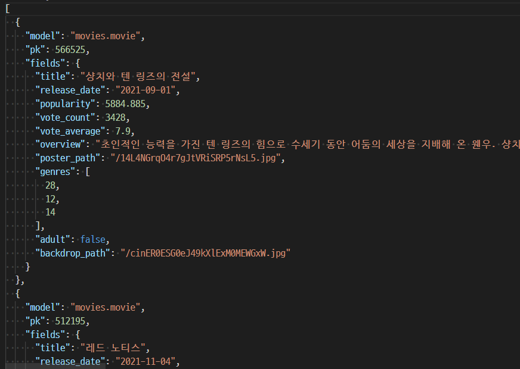


- 데이터베이스 모델링
- 개발한 영화 추천 서비스에서 모든 page를 랜더링 및 라우팅 할 때 쓸 모든 자료들을 추출하고, Django Model을 구성하여 필요 데이터를 SQLite에 연동<br> => 배포 시에는 postgreSQL 사용


##### db.sqlite3 테이블 (특정 몇 개만 선정)

- `accounts_user`

  | 필드명        | 자료형  | 설명               |
  | :------------ | ------- | ------------------ |
  | id            | Integer | Primary Key        |
  | password      | String  | 비밀번호           |
  | Last_login    | Date    | 날짜 시간          |
  | is_superuser  | Bool    | 최상위 관리자 권한 |
  | username      | String  | 유저 아이디        |
  | email         | String  | 이메일             |
  | is_staff      | Bool    | 관리자 권한        |
  | name          | String  | 유저 이름          |
  | profile_photo | String  | 유저 프로필 이미지 |

- `movies_movie`

| 필드명        | 자료형  | 설명                   |
| ------------- | ------- | ---------------------- |
| id            | Integer | Primary Key            |
| title         | String  | 영화 제목              |
| popularity    | Float   | 인기도                 |
| vote_count    | Int     | 총 투표 수             |
| vote_average  | Float   | 평균 투표 점수         |
| overview      | Text    | 줄거리                 |
| poster_path   | String  | 영화 포스터 이미지 URL |
| adult         | Bool    | 성인 유무              |
| backdrop_path | String  | 영화 백 이미지         |
| genres        | Array   | 영화 장르 pk 리스트    |

- `community_review`

| 필드명     | 자료형  | 설명                            |
| ---------- | ------- | ------------------------------- |
| id         | Integer | Primary Key                     |
| title      | String  | 리뷰 제목                       |
| content    | Float   | 리뷰 내용                       |
| rank       | Int     | 영화에 대한 리뷰에서 주는 별점  |
| created_at | Float   | 리뷰 생성 시간                  |
| updated_at | Text    | 리뷰 수정 시간                  |
| author_id  | String  | 리뷰 작성자 id (user 모델 참조) |
| movie_id   | Bool    | 리뷰 영화 id (movie 모델 참조   |


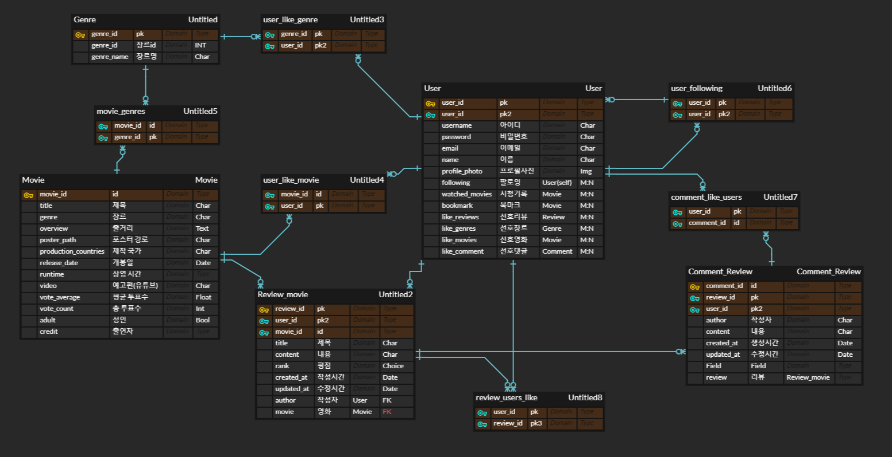


## 4. 필수 기능에 대한 설명

#### TMDB API를 사용한 영화 데이터 크롤링

- 수집한 영화 데이터 : 약 9,900개

`sample.py`

```python
...(생략)
for name in movie_list:
    try:
        url = popurlar.format_map(Default(movies=name, key=apikey))
        r = requests.get(url)
        data = json.loads(r.text)
        # print(data)

        for j in data["results"]:
            url2 = credit.format_map(Default(movie_id=j["id"], key=apikey))
            print(j["id"])
            c = requests.get(url2)
            c_data = json.loads(c.text)
            # print(c_data)
            cre = {"movie_id": j["id"]}
            cre["cast"] = c_data["cast"]
            cre["crew"] = c_data["crew"]
            ret.append(cre)
     except:
         print('pass')

json.dump(ret, json_file, ensure_ascii=False)
```

- python과 API를 활용해 영화 데이터를 Json 파일로 추출
- 서비스 배포 후, postgreSQL에 loaddata 명령어로 데이터 삽입


#### A. 관리자 뷰

- 관리자 페이지
  - 일반 유저와는 권한이 다른 관리자를 설정
  - 관리자 페이지를 통한 영화, 유저 정보 관리


#### B. 영화 정보

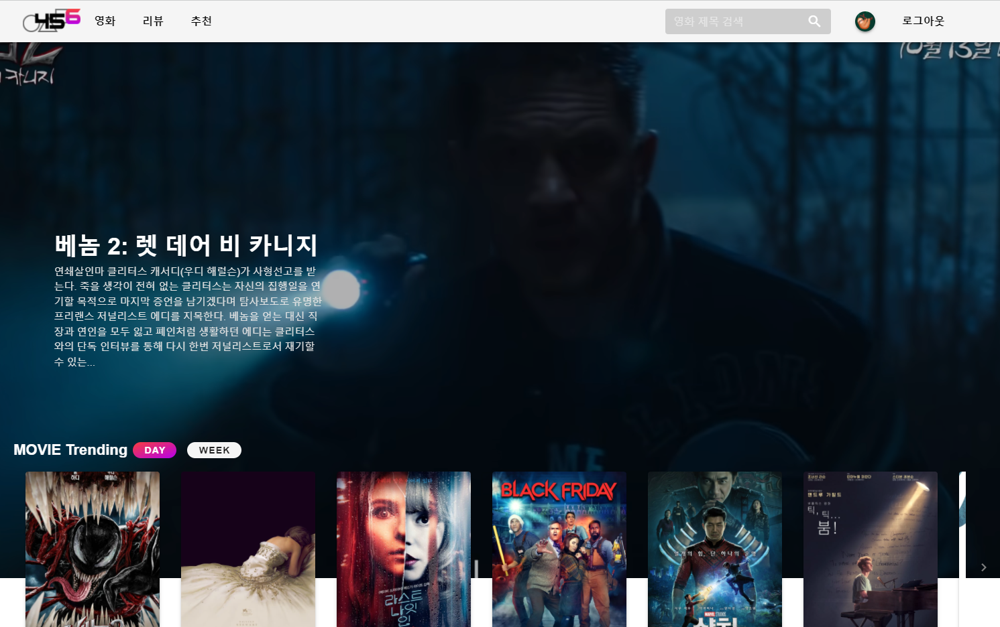

##### 첫번째 서비스 랜딩 페이지

- 최상단에 고정된 Nav bar와 Movie Trending, Top Rate 기준으로 영화를 보여줍니다.
- 상단에 자동 재생되는 영상은 Movie Trending에서 DAY, WEEK 기준으로 1위 영화에 대한 영상과 제목, 줄거리를 보여줍니다.
- 영화 포스터에 마우스를 호버 시키면 영화 정보와 평점 정보를 보여줍니다.

`Main.vue`

```vue
...(생략)
    <iframe
      v-if="videoId"
      class="video-player main-video"
      type="text/html"
      :src="`https://www.youtube.com/embed/${videoId.key}?autoplay=1&mute=1&loop=1&playlist=${videoId.key}`"
      frameborder="0"
      allowfullscreen
      width="100%"
      height="1080px"
    >
    </iframe>

    <div v-if="trending" class="main-movie">
      <p class="main-movie-title">{{ trending[0].title }}</p>
      <p class="main-movie-overview d-d">{{ trending[0].overview | truncate }}</p>
    </div>

    <div class="main-contents">
      <trending id="trending"></trending>
      <top-rate id="top-rate"></top-rate>
    </div>
(생략)...
```


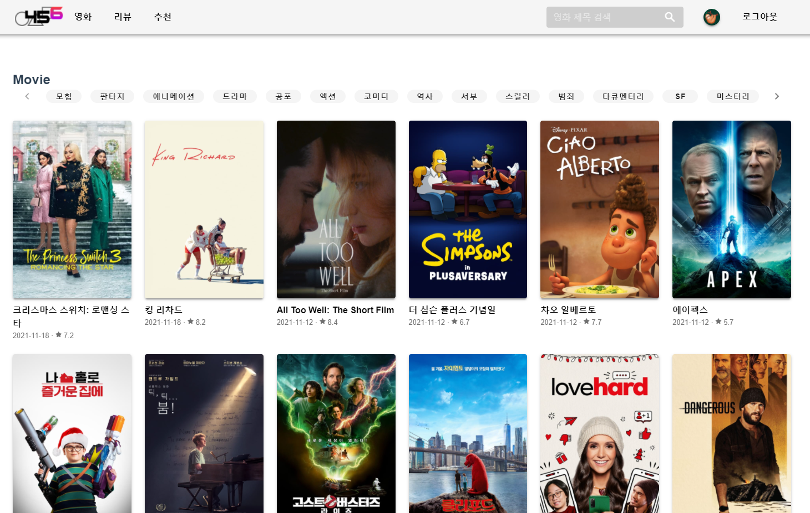

##### 장르별 영화 페이지

- 19가지의 장르를 기준으로 영화 데이터를 보여줍니다.
- 복수의 장르를 가지고 있는 영화는 장르를 여러개 선택해 영화 검색의 정확도를 높일 수 있습니다.
- infinite-scroll을 구현해 유저의 요청에 따라 지속적으로 영화를 보여줄 수 있도록 구현했습니다.

`Movie.vue`

```vue
...(생략)
      <v-row v-else class="movie-cards">
          <movie-card 
            v-for="movie in movieList" 
            :key="movie.id"
            :movie="movie"
          ></movie-card>
      </v-row>
    </v-container>

    <infinite-loading @infinite="infiniteHandler" spinner="waveDots"></infinite-loading>
```


##### 영화 상세 페이지

- 메인 페이지, 장르별 영화 페이지 등에서 영화 포스터를 통해 각 영화의 상세 페이지로 이동이 가능합니다
- TMDB에 있는 평점 정보, 감독 및 배우 등의 정보를 가져와 정보를 제공합니다.
- 상세 정보외에도 해당 영화의 장르를 기준으로 비슷한 영화를 추천하고, 해당 영화에 대한 영상을 보여줍니다.


#### C. 추천 알고리즘


##### 영화 추천 페이지

- 페이지 내에서 Tab을 활용하여 추천 시스템을 변경할 수 있습니다.
- 선호하는 영화를 선택하는 게임과, 복권 형식의 영화 추천을 통해 사용자에게 서비스를 제공합니다.


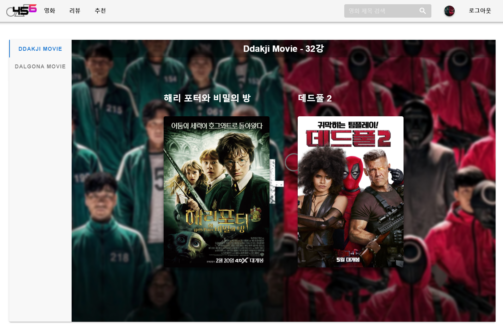


- 영화 선택 게임을 통해서 총 32강에 해당하는 영화를 추천받고 그 중 사용자가 최종적으로 고른 영화의 장르 데이터가 사용자에게 저장됩니다.
- 복원 형식의 추천에서는 영화 포스터 위에 달고나 이미지를 추가해 일정 부분 긁어내면 해당 영화의 상세페이지로 이동합니다.


#### D. 커뮤니티

- 리뷰 작성
  - 로그인 한 유저는 평점과 코멘트 등록, 수정, 삭제 가능
  - 평점과 코멘트를 남긴 영화는 컬렉션 형태로 커뮤니티에 표시 (리뷰 작성 4개 이상 유저만)


##### 리뷰 작성 페이지

- 사용자는 리뷰 작성 시 평점과, 리뷰 제목, 리뷰 내용을 입력할 수 있습니다.


##### 리뷰 상세 페이지

- 사용자는 리뷰 상세 페이지에서 리뷰 내용을 확인 가능합니다.
- 또한 해당 리뷰에 대한 댓글들을 작성할 수 있습니다.


##### 커뮤니티 페이지

- 커뮤니티 페이지는 컬렉션 형태의 페이지로 구현되어 있습니다.
- 일정 리뷰 (4개) 이상의 글을 작성한 사용자들을 대상으로 만들어지며, 해당 컬렉션을 클릭하면 작성자의 모든 리뷰를 볼 수 있습니다.


#### E. 프로필


##### 사용자 프로필 페이지

- 사용자에 대한 정보를 확인할 수 있는 프로필 페이지입니다.
- 해당 사용자가 작성한 리뷰 게시글, 좋아요한 영화 목록 등을 확인할 수 있습니다.
- 추가적으로 해당 사용자의 좋아요한 영화 데이터, 추천 시스템을 통한 데이터 등을 통해서 사용자의 장르별 선호도를 보여줍니다.


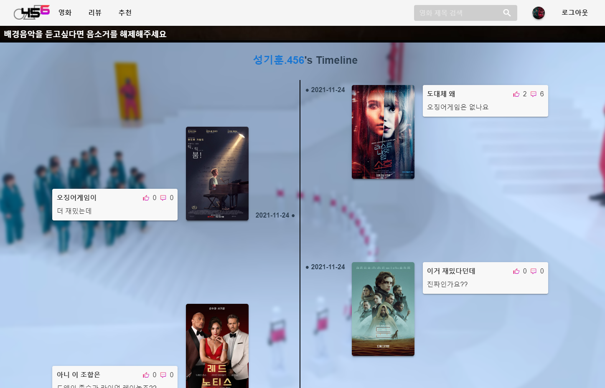

##### 사용자 타임라인 페이지

- 사용자가 작성했던 리뷰를 기준으로 사용자의 타임라인을 보여줍니다.
- 작성된 날짜와 영화, 리뷰 게시글 등을 확인할 수 있습니다.


#### F. 스타일링

- UI/UX
  - Vuetify 라이브러리를 이용해 어플리케이션에 최적화된 디자인 구현
  - Single Page App으로 페이지 리로드 최소화
  - 상세 이미지는 하단 7. 결과 참조


## 5. 배포 서버 URL

#### No.456

##### 배포 환경

##### Client / Server


##### Server to Cloud


- https://456pjt.netlify.app/


## 6. 기타(느낀점)

지금까지 배웠던 다양한 부분을 총 정리하고 시도해 볼 수 있는 좋은 기회였습니다.

프로젝트를 진행하면서 생각한 것을 실제로 구현하기 위한 과정이 꽤 어려운 경우가 있었는데, 단순히 머리 속에서 구상한 것이 전부가 아님을 느낄 수 있었습니다.

그렇지만, 구글에서 하나씩 찾아가며 해결하면서 완성되는 것을 보고 새로운 경험을 할 수 있었습니다.

일주일 내내 하루도 안 쉬고 같이 협업해가며 점점 완성해가는 프로젝트를 보면서 뿌듯함을 느낄 수 있었습니다.

또한, 웹 서비스의 처음부터 끝까지 제작하면서 쉬운 것이 하나도 없다는 것을 느꼈고, 기획 단계부터 배포까지 해보면서 전체 과정을 알 수 있어 새롭고 값진 경험이었습니다. 

프로젝트의 구조와 동작원리, 공식 문서 등의 중요성을 알 수 있었던 시간이었습니다.

개발자로서 한 단계 더 성장했다는 느낌을 스스로 받으면서 성취감도 얻을 수 있었습니다. 

시간이 좀 더 있었다면 더 만족할 수 있는 기능을 구현할 수 있었을텐데 이 점이 많이 아쉬운 점입니다. 이번 프로젝트 경험을 바탕으로 더 발전한 개발자가 될 수 있도록 하겠습니다.


## 7. 결과 (이미지)

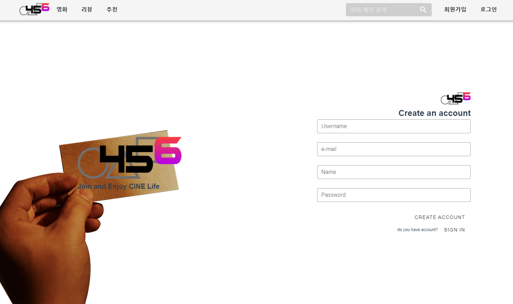


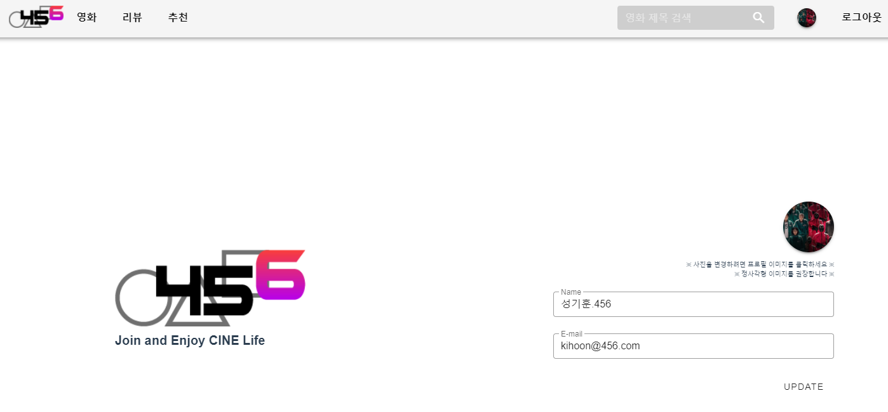


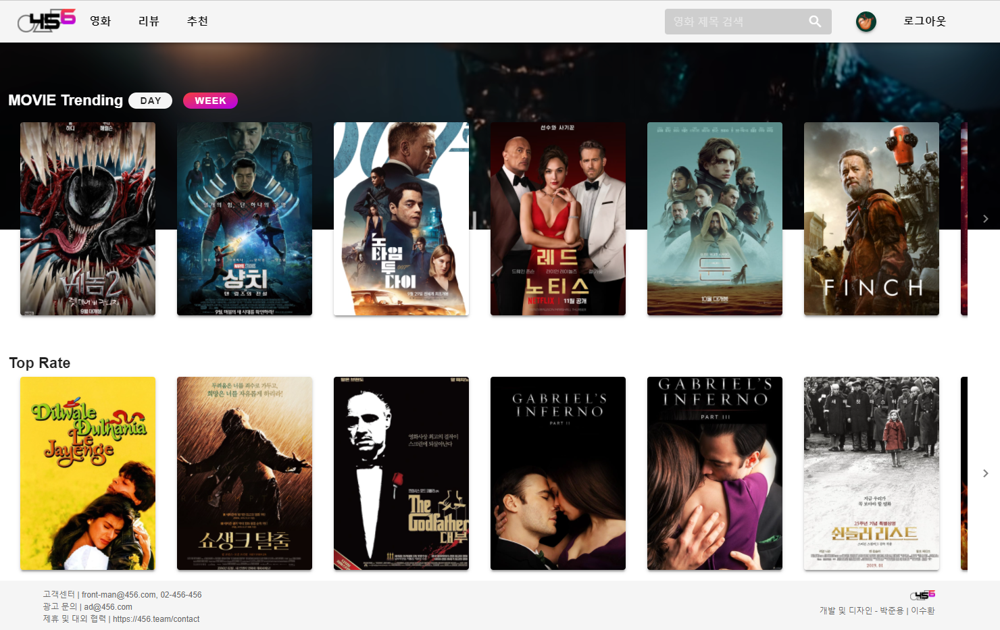


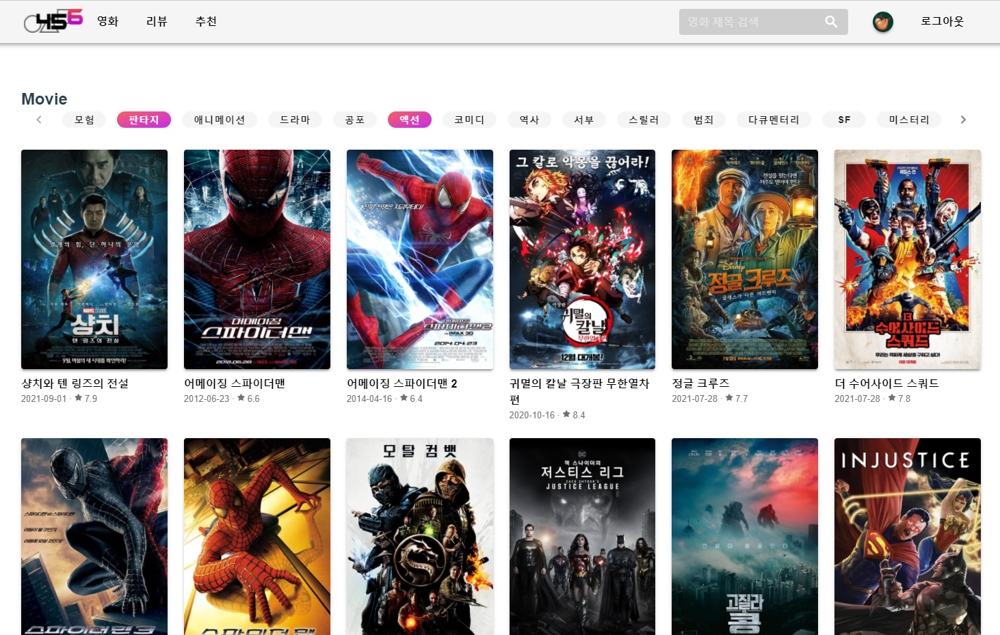

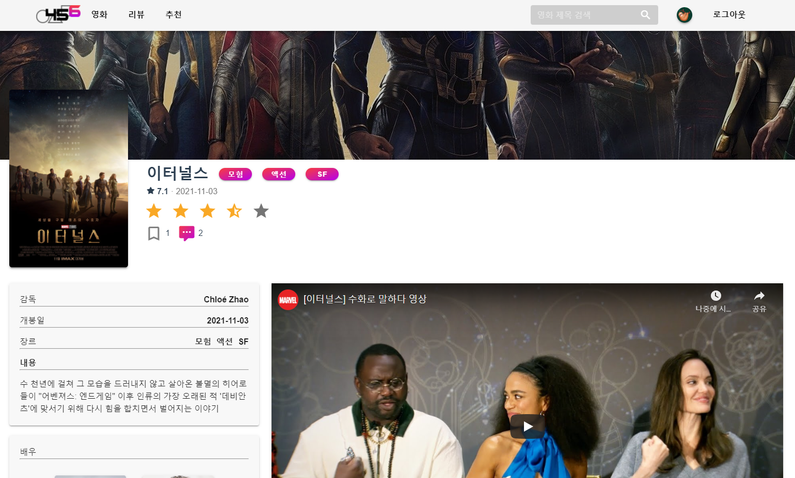

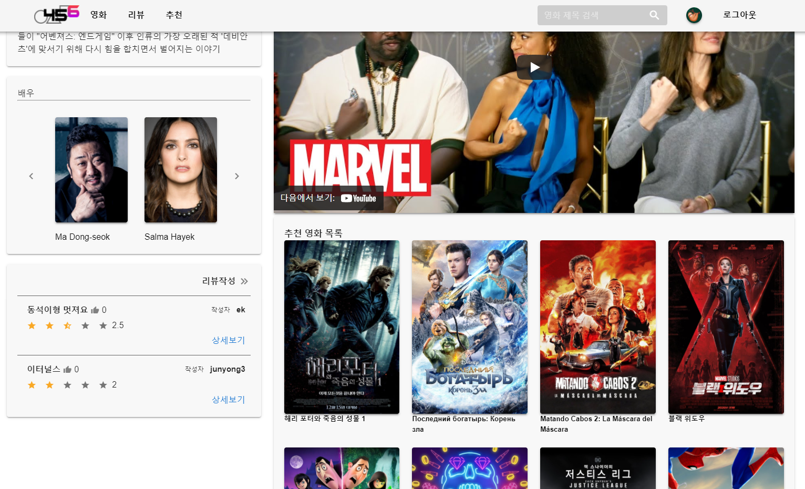

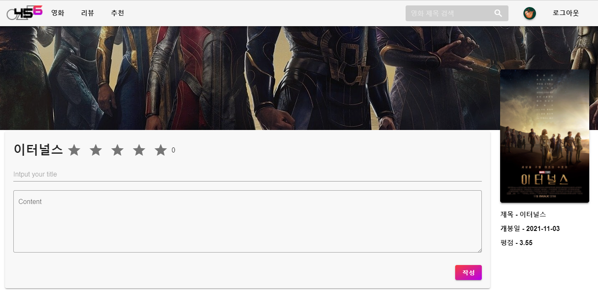

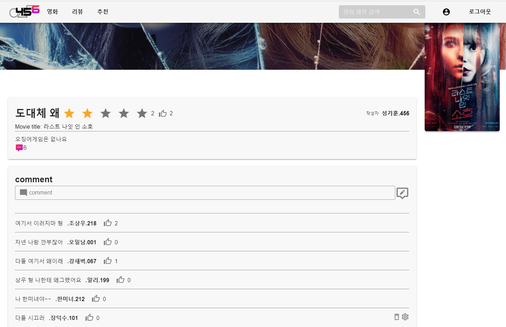

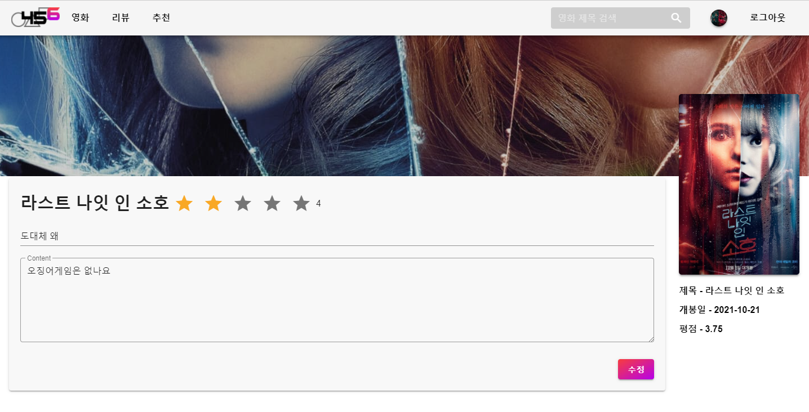

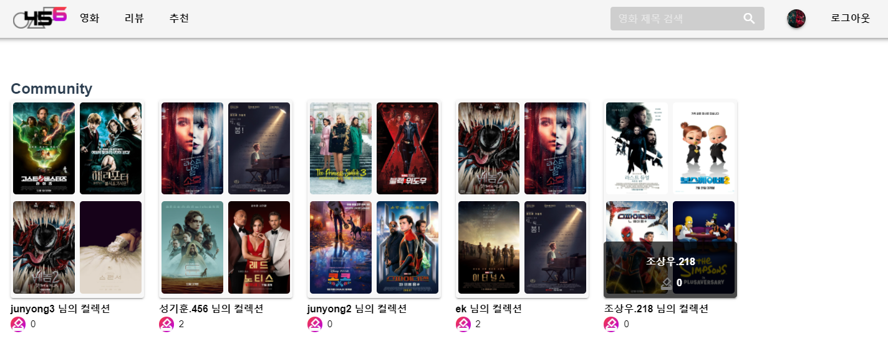

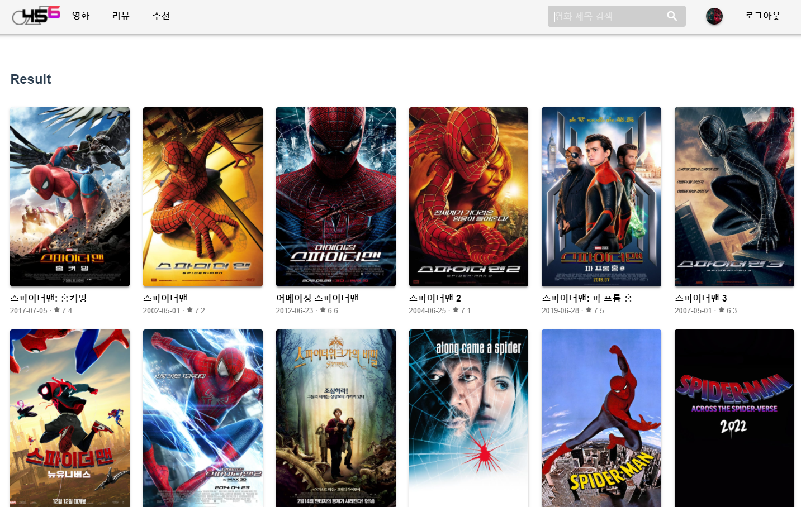

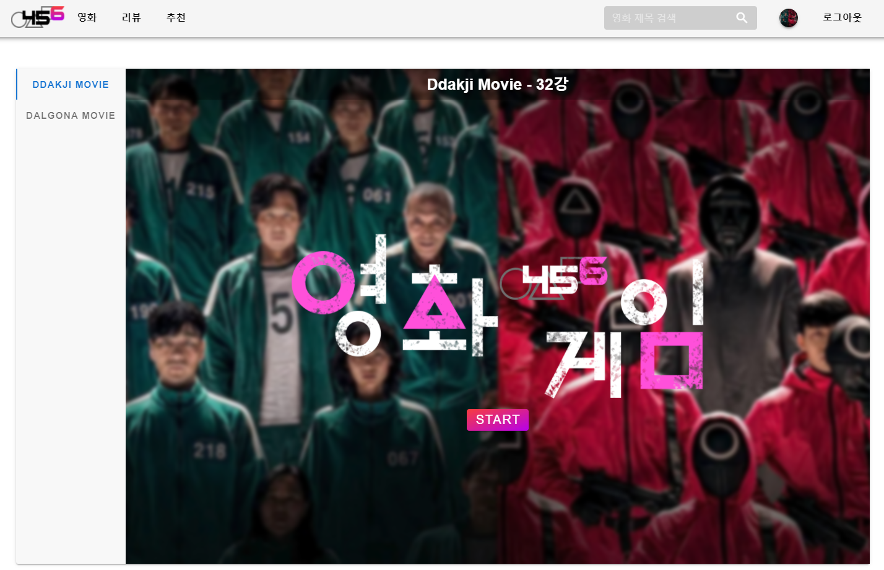


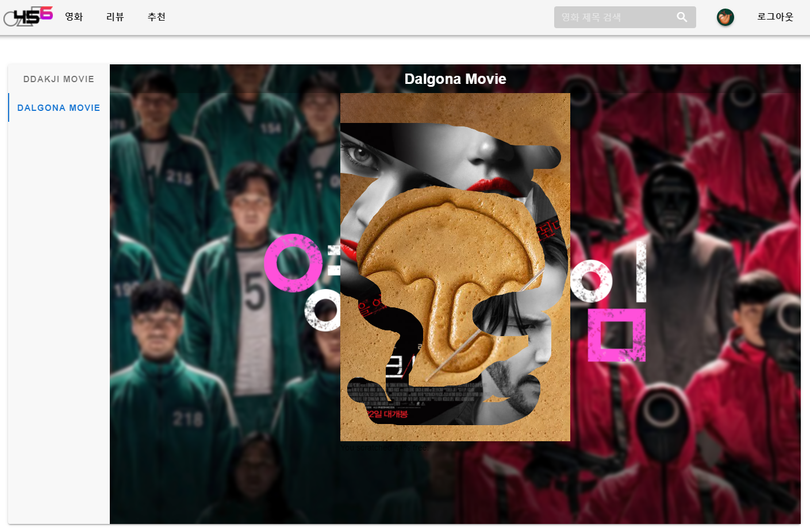

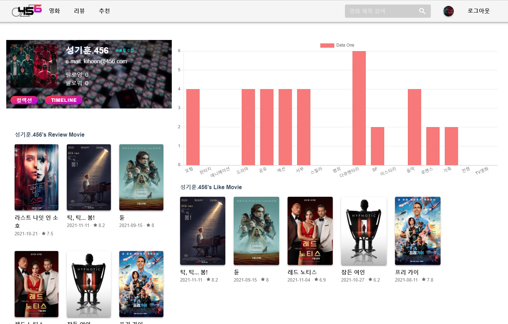


### 끝!

### 감사합니다~!!

